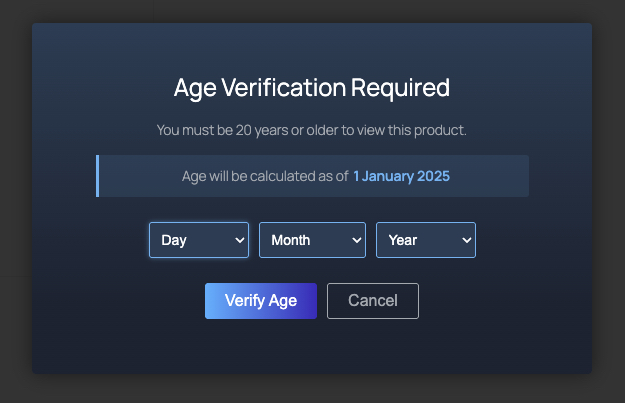

# ThaiTop Age Verification Popup

A WordPress plugin for adding age verification popups to WooCommerce products.

## Key Features

- ✅ Individual product age verification settings
- ✅ Customizable minimum and maximum age requirements
- ✅ Accurate age calculation with date precision
- ✅ Calculate age from current or custom date
- ✅ Buddhist year display support (BE)
- ✅ 4 color templates (Steam, Dark, Light, Nature)
- ✅ Full color customization options
- ✅ Mobile-responsive design
- ✅ Multi-language support
- ✅ WooCommerce HPOS compatible

## Version Information

- Current Version: 1.1.0
- Last Updated: March 2024
- Requires WordPress: 5.0+
- Tested up to WordPress: 6.7
- Requires PHP: 7.2+
- Requires WooCommerce: 6.0+
- Tested up to WooCommerce: 8.4

## Installation

1. Upload plugin files to `/wp-content/plugins/thaitop-age-verification-popup` directory
2. Activate the plugin through the 'Plugins' menu in WordPress
3. Configure plugin settings in WooCommerce > Settings > Age Verification

## Usage

### General Settings
1. Go to WooCommerce > Settings > Age Verification
2. Configure basic settings:
   - Display style and colors
   - Buddhist year display option
   - Default messages and templates

### Product Settings
1. Open product edit page
2. Go to 'Age Verification' tab
3. Enable age verification
4. Configure:
   - Minimum age requirement
   - Maximum age limit (optional)
   - Age calculation method
   - Reference date (if using custom date)

### Age Verification Features
- Precise age calculation considering year, month, and day
- Support for both minimum and maximum age restrictions
- Optional Buddhist calendar year display
- Custom reference date support
- Session-based verification memory

### Plugin Screenshot
 

## Support

For support and assistance:
- Website: [https://thaitoptecs.com](https://thaitoptecs.com)
- Documentation: [Plugin Documentation](https://thaitoptecs.com/docs/age-verification-popup)

## License

This plugin is released under GPL v2 or later - see [LICENSE](http://www.gnu.org/licenses/gpl-2.0.html) for details

## Changelog

### Version 1.1.0
- Added maximum age restriction feature
- Added Buddhist year display support
- Improved age calculation accuracy
- Fixed date comparison issues
- Enhanced error handling
- Updated WooCommerce compatibility

### Version 1.0.0
- Initial release